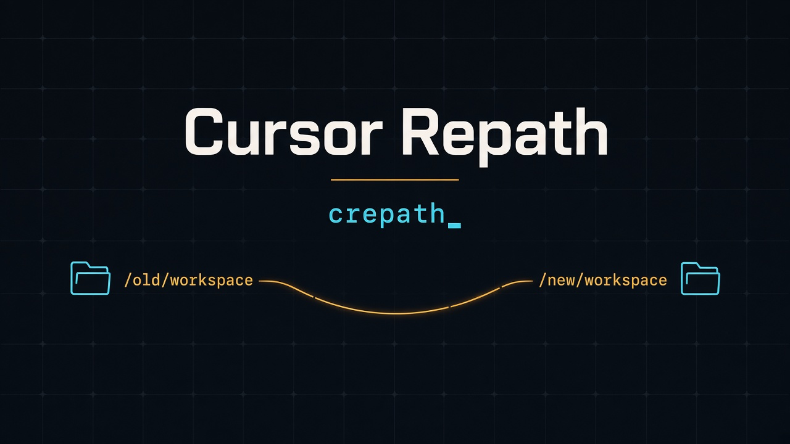

<p align="center">
  
</p>

## Install

### macOS / Linux

```bash
curl -fsSL https://raw.githubusercontent.com/SherinBloemendaal/cursor-repath/main/install.sh | bash
```

Pin a release with `bash -s`:

```bash
curl -fsSL https://raw.githubusercontent.com/SherinBloemendaal/cursor-repath/main/install.sh | bash -s v1.0.0
```

The script installs `crepath` to `~/.crepath/bin` (override with `CREPATH_INSTALL`). It adds that directory to your zsh, bash, or fish config when the line is missing. Run it again to upgrade in place.

### Windows

```powershell
powershell -c "irm https://raw.githubusercontent.com/SherinBloemendaal/cursor-repath/main/install.ps1|iex"
```

`$env:CREPATH_VERSION` pins a tag (`v1.0.0`). `$env:CREPATH_INSTALL` overrides the install directory (default `%USERPROFILE%\.crepath\bin`). The script adds that directory to the user PATH when it is missing.

Published archives, checked against `SHA256SUMS` on the GitHub release:

| Platform | Asset |
| --- | --- |
| macOS Apple Silicon | `crepath-aarch64-apple-darwin.tar.gz` |
| macOS Intel | `crepath-x86_64-apple-darwin.tar.gz` |
| Linux x86_64 (glibc) | `crepath-x86_64-unknown-linux-gnu.tar.gz` |
| Linux arm64 (glibc) | `crepath-aarch64-unknown-linux-gnu.tar.gz` |
| Windows x64 | `crepath-x86_64-pc-windows-msvc.zip` |

<p align="center">
  <a href="https://github.com/SherinBloemendaal/cursor-repath/actions/workflows/ci.yml"></a>
  <a href="LICENSE"></a>
  
  
</p>

## Cursor Repath

**Cursor Repath** (`crepath`) keeps Cursor chat history attached to a project when the folder moves. Repo: [github.com/SherinBloemendaal/cursor-repath](https://github.com/SherinBloemendaal/cursor-repath).

Cursor stores chats against a workspace path. Rename or move that folder and the history stays behind. `crepath` rewrites the local references so the chats follow.

It is not affiliated with Anysphere. It only reads files already on your machine. See [DISCLAIMER.md](DISCLAIMER.md).

Close Cursor before any command that writes. `crepath` aborts if Cursor is running, and again if Cursor starts mid-run. `-n` previews without writing. `-y` skips the single warning prompt.

## Commands

Any command with no arguments opens the picker (space toggles, Enter once, then one validation screen). `crepath` with no command prints colored help. There is no `mg` command.

| Command | What it does |
| --- | --- |
| `crepath mv [FROM] [TO]` | Repath workspace metadata. Alias: `move`. |
| `crepath cp [FROM] [TO]` | Copy: new workspace identity, chats duplicated. Alias: `copy`. |
| `crepath save [ID] [TO]` | Attach an unsaved `Workspaces/<ts>` session to a folder or `.code-workspace`. Metadata only. |
| `crepath split [SOURCE] [TARGETS...]` | Copy chats from one workspace into separate projects. |
| `crepath combine [TARGET] [SOURCES...]` | Pull chats from several workspaces or chats into one target. |
| `crepath rx [TARGET]` | Rebuild registry refs, rewrite leftover path refs, clear caches. Alias: `reindex`. |
| `crepath ls` | Table of workspaces. Alias: `list`. `ls <id>` shows the chat list. |
| `crepath rm [TARGET]` | Remove workspace metadata, or one chat (including subagents). One confirmation. |
| `crepath export [TARGET] [FILE]` | Write a `.crepath` gzip archive. |
| `crepath import [FILE] [TO]` | Restore a `.crepath` archive. |
| `crepath history` | Local log at `~/.crepath/history.jsonl`. Entries older than 30 days are pruned on write. |
| `crepath stats` | Profiles, workspaces, chats, disk, tokens, models. |
| `crepath help` | Colored help. |
| `crepath update` | Download and install the latest release for this OS. |
| `crepath github` | Open the GitHub repository in the browser. |

`crepath update` checks `SHA256SUMS`, then replaces the binary in `$CREPATH_INSTALL` or `~/.crepath/bin`.

`crepath github` opens https://github.com/SherinBloemendaal/cursor-repath.

`mv` and `cp` change metadata only. `--project` also moves the real folder. `--project` is refused when the destination parent is missing.

`split` copies by default. `--move` removes the chats from the source.

`combine` copies by default (`--copy`). `--move` removes the chats from the sources. The target can be an existing workspace, or a real folder or `.code-workspace` path that `crepath` creates. Sources are whole workspaces or individual chats.

`ls` columns: profile, kind (folder, code-workspace, unsaved, empty-window), path, chats, subagents, size, hash, and a destination-missing flag. `--unsaved` limits the table to unsaved sessions.

A missing destination is a warning. That item is skipped.

### Shared flags

| Flag | Effect |
| --- | --- |
| `-n` | Dry-run. Write nothing. |
| `-y` | Skip the single warning prompt. |
| `--profile NAME` | Limit the run to one Cursor profile. |
| `--replace FROM TO` | Batch-rewrite a path prefix. |
| `--regex` | Treat `--replace` FROM as a regular expression. |
| `--unsaved` | Include or filter unsaved `Workspaces/<ts>` sessions. |

### Examples

```bash
crepath mv --replace /OrbStack/noble/ /OrbStack/resolute/ -y
crepath save 1765558213752 ~/projects/foo
crepath split 5af0e30872454aba2290760e07cae157 ~/projects/api ~/projects/frontend
crepath combine ~/projects/api 7b86a000ce7c6377c39429a3bd7e2080 9d95c4710638ebad3cb7aaa3bec9a067 --move
```

## Split assignment

`split` asks which chats go where. Three modes, in this order:

1. **Auto-suggest (default).** For each chat, touched file paths are mapped to the longest matching target root. A table shows the title, date, and suggested targets. Space toggles targets. Chats with no evidence stay **unassigned** until you pick a target.
2. **All to all.** Every chat is copied to every target.
3. **Manual.** Pick chats per target, with no suggestions.

## Export archive

`export` writes a `.crepath` gzip archive: the `workspaceStorage` directory, the projects directory, `composerHeaders` rows, composer-keyed `cursorDiskKV` rows, a `storage.json` excerpt, and a manifest with version and checksums. `import` reads that archive back.

## Where Cursor stores it

Each workspace id is derived from the absolute path and the filesystem birth time. Linux filesystems without birth time can hash differently.

| Platform | Workspace storage |
| --- | --- |
| macOS | `~/Library/Application Support/Cursor/User/workspaceStorage/` |
| Linux | `~/.config/Cursor/User/workspaceStorage/` |
| Windows | `%APPDATA%\Cursor\User\workspaceStorage\` |

`crepath` also updates `workspace.json`, `globalStorage/storage.json`, the matching rows in `globalStorage/state.vscdb`, and `~/.cursor/projects/`. The default user directory and each `userDataProfiles` entry are included. `--profile` filters that set.

A backup is taken before the first write, so an abort leaves a restorable state.

## Build from source

Requires Rust 1.88+.

```bash
git clone https://github.com/SherinBloemendaal/cursor-repath
cd cursor-repath
cargo install --path .
```

## License

[MIT](LICENSE)
